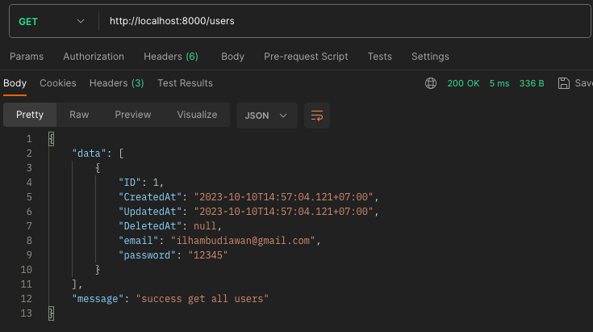
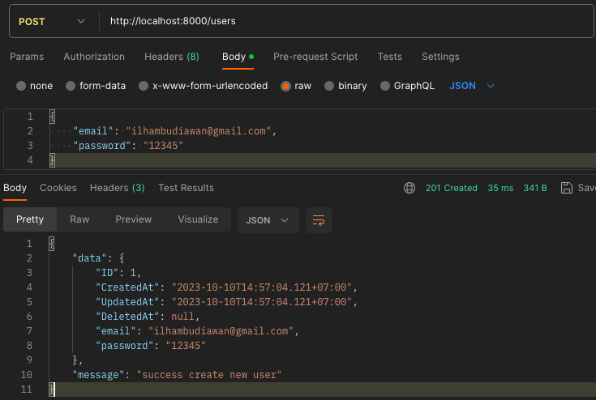

# Instruction

## Library yang dipakai
```go
go get github.com/labstack/echo/v4
go get -u gorm.io/gorm
go get -u gorm.io/driver/mysql
go get github.com/joho/godotenv
go get github.com/sirupsen/logrus
go get -u github.com/golang-jwt/jwt/v5
go get -u github.com/stretchr/testify
```

## Struktur Project

```
├── cmd
│   ├── main.go
│   └── user
│       └── user.go
├── config
│   └── config.go
├── domain
│   └── user
│       ├── user.go
│       └── user_repository.go
│   
├── infrastructure
│   ├── database
│   │   ├── migrate.go
│   │   └── user_repository_impl.go
│   └── http
│       └── user
│          └── user_handler.go
├── mocks
│   ├── domain
│   │   └── user
│   │       └── user_repository_mock.go
│   │       
│   └── infrastructure
│       ├── database
│       │   └── user_repository_mock.go
│       └── http
│           └── user
│               └── user_handler_mock.go
├── test
│   ├── domain
│   │   └── user
│   │       └── user_test.go
│   └── infrastructure
│       ├── database
│       │   └── user_repository_test.go
│       └── http
│           └── user
│               └── user_handler_test.go
├── .gitignore
├── .env
├── go.mod
├── go.sum
└── README.md
```

1.  **cmd**:
    -   Folder `cmd` adalah tempat untuk memulai aplikasi. Biasanya terdapat file `main.go` di sini yang bertanggung jawab untuk memulai aplikasi.
2.  **config**:
    -   Folder `config` berisi file atau paket untuk mengelola konfigurasi aplikasi, seperti pengaturan koneksi database, konfigurasi server, dll.
3.  **domain**:
    -   Folder `domain` berisi definisi dari model bisnis atau entitas aplikasi. Misalnya, Kamu memiliki folder `user` dan `post` yang masing-masing berisi definisi dari model User dan Post.
4.  **infrastructure**:
    -   Folder `infrastructure` berisi implementasi dari detail teknis, seperti penyimpanan data (dalam kasus ini, implementasi repository), dan interaksi dengan lapisan infrastruktur (HTTP handlers).
    -   **database**:
        - Kamu juga bisa menambahkan file `Migrate.go` untuk melakukan migrate table ke database.
        -   Di dalam `database`, Kamu akan menemukan file `user_repository_impl.go`, yang berisi implementasi konkret dari interface repositori yang didefinisikan di domain.
    -   **http**:
        -   Di dalam `http`, terdapat folder `user` dan `post`, masing-masing berisi handler untuk mengelola request dan response HTTP yang berkaitan dengan entitas User dan Post.
5.  **mocks**:
    -   Folder `mocks` berisi definisi dari "palsu" (mock) atau tiruan dari berbagai interface dan class yang digunakan dalam aplikasi. Ini sangat berguna untuk Unit Testing.
6.  **test**:
    -   Folder `test` berisi file-file pengujian (unit testing) untuk menguji berbagai komponen dari aplikasi. Ini termasuk pengujian untuk domain, infrastruktur, dan handler HTTP.
7.  **.gitignore**:
    -   Berkas `.gitignore` berisi daftar file dan folder yang tidak perlu disertakan dalam repositori git.
8.  **go.mod** dan **go.sum**:
    -   Berkas `go.mod` dan `go.sum` adalah bagian dari sistem manajemen dependensi Go (Go Modules). Mereka digunakan untuk memastikan bahwa proyek dapat dikompilasi dengan benar dengan semua dependensi yang diperlukan.
9.  **README.md**:
    -   Berkas `README.md` biasanya berisi dokumentasi proyek, termasuk cara mengonfigurasi dan menjalankannya.

## Uji Coba End Point

| Route         | HTTP Method | Deskripsi                            | Postman          |
|--             |--           |--                                    |--                |
| /users        | GET         | Mendapatkan semua data user          |       |  
| /users        | POST         | Buat data user          |       |    